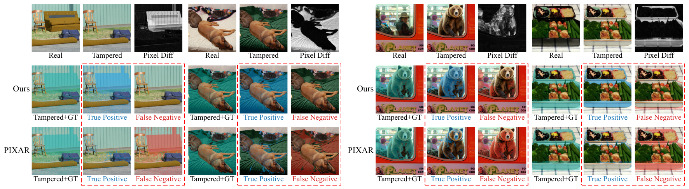
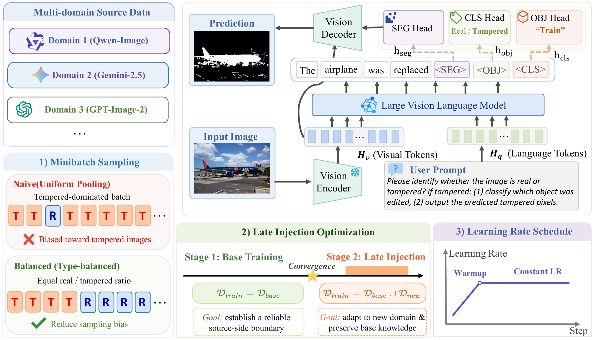
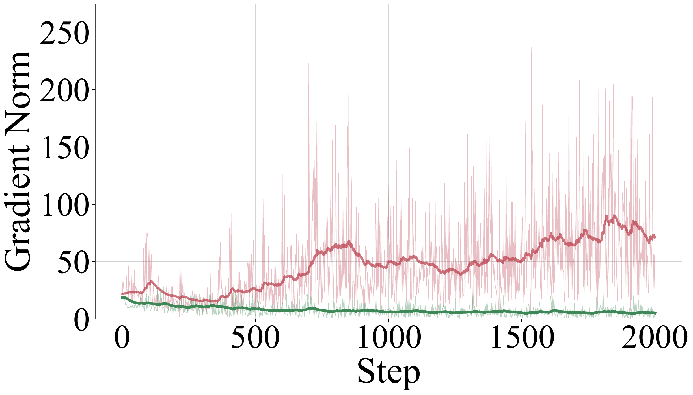
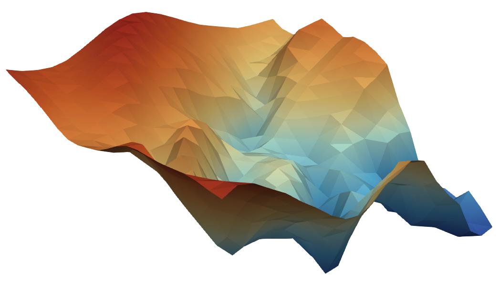
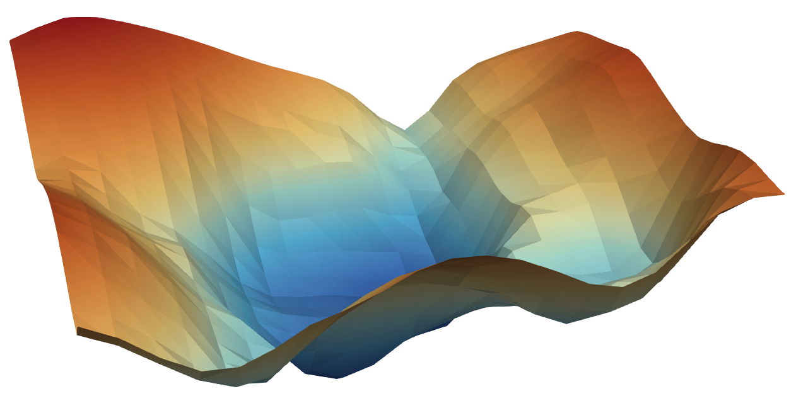

<div align="center">

# Simple Domain Generalization for Strong<br>Pixel-Level Image Tampering Detection in Modern VLMs

<p>
  <a href="http://arxiv.org/abs/2607.18230"></a>
  &nbsp;
  <a href="https://huggingface.co/jiachengcui888/PIXAR-7B"></a>
  &nbsp;
  <a href="#models"></a>
  &nbsp;
  <a href="./LICENSE"></a>
</p>

<p>
  
  &nbsp;
  
</p>

<p>
<a href="https://github.com/TangentOne"><strong>Yi Tang</strong></a><sup>1,*</sup>&ensp;
<a href="https://scholar.google.com/citations?user=pkfBYHAAAAAJ&hl=zh-CN"><strong>Xinyi Shang</strong></a><sup>1,2,*</sup>&ensp;
<a href="https://scholar.google.com/citations?user=SI_9kD0AAAAJ&hl=zh-CN"><strong>Jiacheng Cui</strong></a><sup>1</sup>&ensp;
<a href="https://scholar.google.com/citations?user=m10_qBQAAAAJ&hl=zh-CN"><strong>Sondos Mahmoud Bsharat</strong></a><sup>1</sup><br>
<a href="https://openreview.net/profile?id=~Jiacheng_Liu8"><strong>Jiacheng Liu</strong></a><sup>1</sup>&ensp;
<a href="https://scholar.google.com/citations?user=PliLuD4AAAAJ&hl=zh-CN"><strong>Xiaohan Zhao</strong></a><sup>1</sup>&ensp;
<a href="https://scholar.google.com.vn/citations?user=NTeODecAAAAJ&hl=en"><strong>Tran Dinh Tien</strong></a><sup>1</sup>&ensp;
<a href="https://openreview.net/profile?id=~Ahmed_Elhagry1"><strong>Ahmed Elhagry</strong></a><sup>1</sup><br>
<a href="https://scholar.google.com/citations?user=TWtF0CAAAAAJ&hl=en"><strong>Salwa K. Al Khatib</strong></a><sup>1</sup>&ensp;
<a href="https://scholar.google.com/citations?user=JlUDjukAAAAJ&hl=en"><strong>Tianjun Yao</strong></a><sup>1</sup>&ensp;
<a href="https://scholar.google.com/citations?user=vyX6kpwAAAAJ&hl=en"><strong>Yonina C. Eldar</strong></a><sup>3</sup>&ensp;
<a href="https://scholar.google.com/citations?user=a6Pul3UAAAAJ&hl=en"><strong>Jing-Hao Xue</strong></a><sup>2</sup><br>
<a href="https://scholar.google.com/citations?user=NFeigSoAAAAJ&hl=en"><strong>Hao Li</strong></a><sup>1</sup>&ensp;
<a href="https://scholar.google.com/citations?user=M59O9lkAAAAJ&hl=en"><strong>Salman Khan</strong></a><sup>1</sup>&ensp;
<a href="https://scholar.google.com/citations?user=DGr0fVoAAAAJ&hl=en"><strong>Zhiqiang Shen</strong></a><sup>1,†</sup>
</p>

<sub><sup>1</sup>Mohamed bin Zayed University of Artificial Intelligence&emsp;<sup>2</sup>University College London&emsp;<sup>3</sup>Weizmann Institute of Science</sub><br>
<sub>* Equal contribution&emsp;|&emsp;† Corresponding author</sub>


<p><sub><em>Predicted tampered pixels — Ours vs. PIXAR — on four held-out (OOD) generators:
GPT-Image-2.0, Gemini-3.1, FLUX.2, Seedream&nbsp;4.5.</em></sub></p>

</div>

> **TL;DR** &nbsp;We study **domain generalization** for pixel-level image tampering detection across modern VLM generators. A simple training recipe — **balanced real/tampered mini-batch sampling**, **late injection** of a small companion source, and a **low constant learning rate** — improves cross-generator localization by up to **26.1% / 26.8%** relative gIoU / cIoU at 13B (**+21.4% / +21.1%** at 7B) over the prior state of the art (PIXAR), while training on only **19.2%** of its data.

---

## News

- **[2026-07]** 🚀 Code for training, dataset construction, and evaluation is released.

---

## Overview

Modern VLMs (ChatGPT, Gemini, Qwen-Image, …) differ sharply in architecture, editing pipeline, and post-processing, so a tampering detector trained on one generator often **overfits to model-specific artifacts** and degrades on unseen generators. We treat each generator as a **domain** and target cross-generator generalization for **pixel-level** tampering localization.

Our framework leaves the segmentation-based detector unchanged and improves only the **training recipe**, with three simple, compatible strategies:

1. **Balanced mini-batch sampling** — every step sees a fixed real:tampered ratio, preventing the optimizer from collapsing onto clean-image priors or tampering artifacts.
2. **Late injection** — train to convergence on a large base source (Qwen-Image), then inject a *small* companion source (Gemini-2.5) so emerging-domain signal is absorbed without dominating early feature learning.
3. **Low constant learning rate** — a conservative constant `2e-5` (warmup-then-hold) schedule preserves transferable forensic cues during adaptation.

---

## Method

<div align="center">

</div>

The detector is built on the [PIXAR](https://arxiv.org/abs/2603.20193) architecture: a LLaVA (LLaMA-2 + CLIP ViT-L/14) backbone with LoRA and a SAM ViT-H mask decoder. Three task tokens drive three prediction heads, and the language model additionally generates a natural-language description of the edit:

| Token | Head | Output |
|:---:|:---|:---|
| `[CLS]` | classification | real vs. tampered |
| `[OBJ]` | multi-label recognition | tampered object categories (80 COCO classes + background) |
| `[SEG]` | SAM prompt | pixel-level tampering mask |

Training optimizes five losses — semantic (multi-label), BCE, DICE, classification, and text. The recipe weights `λ_dice=1.0, λ_sem=0.5, λ_text=3.0` are set in `scripts/train.sh` (the semantic loss is implemented as `--obj_loss_weight` in `train_PIXAR.py`).

### Why it works

Balanced sampling stabilizes optimization: the gradient norm of the `[CLS]` head stays smooth and flat instead of fluctuating under naive sampling, and training settles into a wider, flatter loss basin.

<div align="center">



<p><sub><em>Left: <code>[CLS]</code>-head gradient norm, random (red) vs. balanced (green). Middle &amp; right: loss landscape, PIXAR vs. Ours.</em></sub></p>
</div>

---

## Results

Cross-generator performance, **averaged over four held-out OOD generators** (GPT-Image-2.0, Gemini-3.1, FLUX.2, Seedream 4.5):

| Method | Pixel Recall | Pixel F1 | gIoU | cIoU | Binary Acc. |
|:---|:---:|:---:|:---:|:---:|:---:|
| PIXAR-7B   | 25.8 | 28.5 | 0.159 | 0.166 | 69.6 |
| **Ours-7B**  | **45.1** | **33.3** | **0.193** | **0.201** | **79.6** |
| PIXAR-13B  | 33.5 | 31.0 | 0.176 | 0.183 | 59.0 |
| **Ours-13B** | **62.2** | **37.4** | **0.222** | **0.232** | **84.0** |

Ours-7B is trained on **73,353** tampered images (70,000 Qwen-Image + 3,353 Gemini-2.5) — **19.2%** of PIXAR's 380K — yet improves every averaged metric at both scales. See the paper for per-generator and in-domain results.

---

## Setup

**Python 3.10.** The base requirements install a CUDA 11.7 (cu117) PyTorch; `fix/fix.sh` then migrates the environment to **CUDA 12.1** (cu121 PyTorch, `deepspeed>=0.14.4`, matching `bitsandbytes`/`libstdc++`). Run it after installing:

```bash
conda create -n pixar python=3.10 -y && conda activate pixar
pip install -r requirements.txt
bash fix/fix.sh          # migrate to CUDA 12.1 (run fix/fix_again.sh if issues persist)
```

Place pretrained weights under `pretrains/` (or symlink it):

| Weight | Source |
|:---|:---|
| `pretrains/PIXAR-7B` | base detector for the main recipe — [PIXAR-7B](https://huggingface.co/jiachengcui888/PIXAR-7B) ([PIXAR](https://arxiv.org/abs/2603.20193)); `PIXAR-13B` from the same release |
| `pretrains/sam_vit_h_4b8939.pth` | [SAM ViT-H](https://dl.fbaipublicfiles.com/segment_anything/sam_vit_h_4b8939.pth) |
| `openai/clip-vit-large-patch14` | auto-downloaded |

The code reads `data/`, `pretrains/`, and writes to `outputs/` as relative directories — create them or symlink to your storage.

---

## Data

The training set is built on top of the public **PIXAR benchmark** — download it first, then run the preprocessing scripts. Full details and options are in [`docs/DATA.md`](./docs/DATA.md).

**1. Download the PIXAR benchmark** (preprocessed at τ = 0.05; [Shang et al., 2026](https://arxiv.org/abs/2603.20193)) and place it under `data/`.

**2. Split into train / validation**:

```bash
python preprocess/split_pixar.py \
  --src data/PIXAR_preprocessed/test_full_0.05/full_0.05 \
  --dst data/pixar_0.05
```

**3. Build the headline training set**:

```bash
python preprocess/make_qg_70k_subsets.py \
  --variant 3353x1 \
  --qwen_src   data/PIXAR_preprocessed/train_0.05/ours_0.05 \
  --gemini_src data/pixar_0.05 \
  --out_dir    data
# -> data/pixar_qg_70k_3353x1   (73,353 train tampered; validation symlinked from pixar_0.05)
```

`make_qg_70k_subsets.py` also builds the base-source size variants used in the data-scale study — pass `--variant 30k_3353x1`, `150k_3353x1`, or `380k_3353x1`.

---

## Training

```bash
conda activate pixar
bash scripts/train.sh                 # PIXAR init, full recipe
```

Recipe: PIXAR init, `data/pixar_qg_70k_3353x1`, **lr 2e-5 constant, 4 epochs × 2500 steps, real:tampered = 1:1**, with late injection of Gemini-2.5 from epoch 1 (`{"0-1":{"gemini":0},"1-end":{"gemini":2}}`). Then merge the checkpoint into a standalone HuggingFace model:

```bash
bash scripts/merge.sh --exp_name ours --base_model pretrains/PIXAR-7B
# -> outputs/merged/ours
```

---

## Evaluation

```bash
bash scripts/eval.sh --model outputs/merged/ours --dataset_dir data/pixar_0.05
```

`metrics.json` reports overall accuracy, pixel-level gIoU / cIoU / F1, and a **per-generator** breakdown under `per_model_metrics`. The paper's headline numbers are the mean over the four OOD generators; see [`docs/EVAL.md`](./docs/EVAL.md) for the exact field-to-table mapping and the OOD-average recipe.

---

## Inference

```bash
python inference.py \
  --version outputs/merged/ours \
  --vision_pretrained pretrains/sam_vit_h_4b8939.pth \
  --seg_prompt_mode fuse \
  --image_paths path/to/image.png \
  --output_dir example_outputs
```

The same command runs any merged checkpoint — just point `--version` at it.

---

## Models

| Model | Link |
|:---|:---|
| Ours-7B  | _coming soon_ |
| Ours-13B | _coming soon_ |

---

## Acknowledgements

This work builds on [PIXAR](https://arxiv.org/abs/2603.20193), [SIDA](https://github.com/hzlsaber/SIDA), [LISA](https://github.com/dvlab-research/LISA), [LLaVA](https://github.com/haotian-liu/LLaVA), and [SAM](https://github.com/facebookresearch/segment-anything). We thank the authors for releasing their code and models.

---

## Citation

```bibtex
@article{tang2026simpledg,
  title={Simple Domain Generalization for Strong Pixel-Level Image Tampering Detection in Modern VLMs},
  author={Yi Tang, Xinyi Shang, Jiacheng Cui, Sondos Mahmoud Bsharat, Jiacheng Liu, Xiaohan Zhao, Tran Dinh Tien, Ahmed Elhagry, Salwa K. Al Khatib, Tianjun Yao, Yonina C. Eldar, Jing-Hao Xue, Hao Li, Salman Khan, and Zhiqiang Shen},
  year={2026},
  eprint={2607.18230},
  archivePrefix={arXiv},
  primaryClass={cs.CV},
}

```
